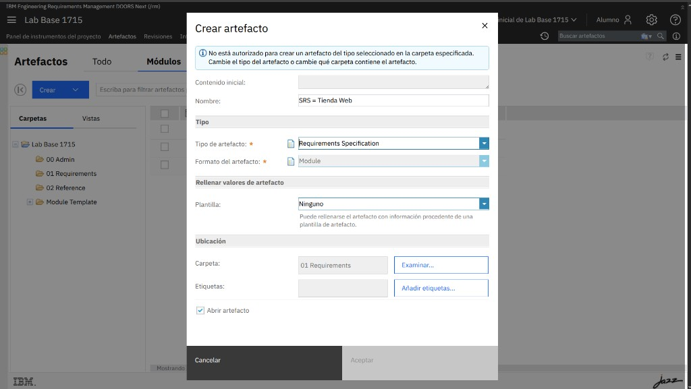
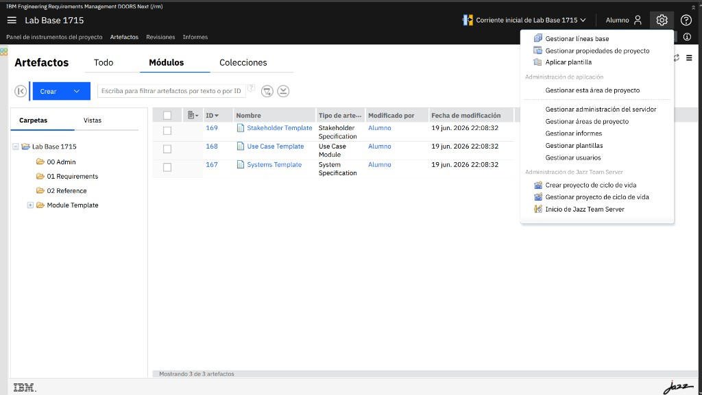
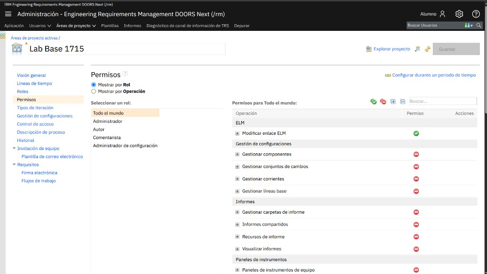
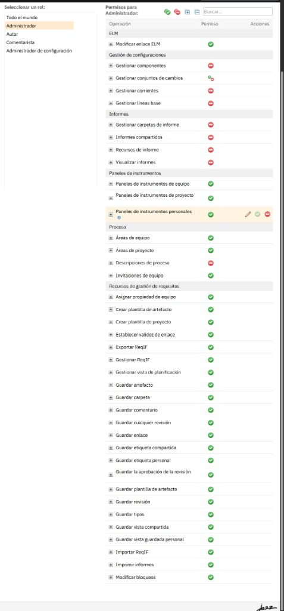

# M01-02 · Gestionar permisos: date autoría en tu proyecto

[← Página anterior](README.md) · [Siguiente página →](../M02-fundamentos-requisitos/README.md)

> [!NOTE]
> **Objetivo** — entender por qué al principio **no puedes crear** nada y concederte
> el permiso de **autoría** en tu proyecto, una sola vez.
>
> ⏱️ ~15 min · 🗂️ Eres **administrador** de tu proyecto · 🎯 Resultado: puedes crear módulos y artefactos.

---

## En qué consiste

Acabas de crear tu proyecto y aplicar una plantilla. Si intentas crear un módulo ahora,
DOORS Next te lo **deniega**. En este lab descubres por qué y **te das permiso** para crear
y editar artefactos.

## Antes de empezar necesitas

- Tu proyecto creado y con una plantilla aplicada → [M01 · Tu proyecto de trabajo](README.md#tu-proyecto-de-trabajo).

---

## Conceptos clave

| Concepto | Qué es |
|---|---|
| **Permiso de repositorio** (JazzAdmins, JazzProjectAdmins…) | Permiso **global** del servidor: administrar áreas, usuarios, licencias. **No** da autoría de artefactos. |
| **Rol de proyecto** (Administrador, Autor, Comentarista, **Todo el mundo**) | Define qué puedes hacer **dentro** de un proyecto concreto. |
| **Todo el mundo** | Rol que se aplica a **cualquier miembro sin rol específico**. Por defecto, casi todo **denegado**. |
| **Guardar artefacto** | El permiso que habilita **crear y editar** artefactos (requisitos, módulos). |

> [!IMPORTANT]
> Ser **Administrador** del proyecto **no** equivale a poder **crear artefactos**. El rol
> Administrador gestiona el **proceso** (roles, plantillas, configuración); la **autoría**
> la concede el permiso **Guardar artefacto**.

---

## Paso a paso

### Paso 1 · Comprueba el problema

**Acción** — entra en tu proyecto → **Artefactos** → pestaña **Módulos** → **Crear ▾** →
elige un tipo de módulo → en el diálogo, Carpeta **`01 Requirements`** → intenta **Aceptar**.

**Qué ves** — un aviso rojo: *"No está autorizado para crear un artefacto del tipo
seleccionado en la carpeta especificada"*, y el botón **Aceptar** en **gris**.

> [!NOTE]
> **Por qué** — tu usuario es admin global, pero **dentro de este proyecto** se le aplica el
> rol **Todo el mundo**, que no tiene permiso de autoría. Vamos a arreglarlo. **Cancela** el diálogo.

---

### Paso 2 · Abre la administración del proyecto

**Acción** — arriba a la derecha, pulsa el **engranaje ⚙️** → **Administración** →
**Gestionar esta área de proyecto**.

**Qué ves** — se abre el **editor del área de proyecto**, con un menú a la izquierda
(Visión general, Roles, **Permisos**…).

---

### Paso 3 · Ve a Permisos y elige el rol

**Acción** — en el menú izquierdo pulsa **Permisos**. En **Seleccionar un rol**, pulsa
**Todo el mundo**.

**Qué ves** — la **matriz de permisos** del rol. Para **Todo el mundo** casi todo está en
**rojo** (denegado): por eso no podías crear.

> [!TIP]
> **Opciones** — en vez de tocar **Todo el mundo**, podrías asignarte el rol **Autor**
> (que ya trae estos permisos) desde **Visión general → Miembros**. Para **tu propio
> proyecto**, conceder a **Todo el mundo** es lo más simple y directo.

---

### Paso 4 · Concede los permisos de autoría

**Acción** — baja hasta la categoría **Recursos de gestión de requisitos**. Para cada
operación de abajo, **pasa el ratón por la fila** y pulsa el **✔ verde** (Permitir):

| Operación | Para qué |
|---|---|
| **Guardar artefacto** | Crear y editar requisitos y módulos. **(imprescindible)** |
| **Guardar carpeta** | Organizar artefactos en carpetas. |
| **Guardar enlace** | Crear trazabilidad (lo usarás en M05). |
| **Guardar tipos** | Ajustar tipos y atributos. |
| **Guardar vista compartida** / **personal** | Guardar vistas de tabla. |
| **Modificar bloqueos** | Editar artefactos bloqueados. |

**Qué ves** — los iconos de esas filas pasan de **rojo** a **verde**.

> [!IMPORTANT]
> **Implicación** — con **Guardar artefacto** en verde, cualquier miembro de tu proyecto
> puede **crear y editar** requisitos. Lo mínimo para seguir el curso es **Guardar
> artefacto** + **Guardar carpeta**; el resto te evita topes en módulos posteriores.

---

### Paso 5 · Guarda los cambios

**Acción** — pulsa **Guardar** (arriba a la derecha de la página de permisos).

**Qué pasa** — la configuración queda aplicada al proyecto. No hace falta reiniciar nada.

---

## ✅ Resultado

Vuelve a **Artefactos → Módulos → Crear** y abre el diálogo: el **aviso rojo ha
desaparecido** y **Aceptar** está **activo**. Ya puedes crear tu primer módulo
→ [M04-01](../M04-creacion-mantenimiento/M04-01-crear-modulo.md).

## Comprueba

- [ ] En **Permisos → Todo el mundo**, la operación **Guardar artefacto** está en **verde**.
- [ ] Has pulsado **Guardar**.
- [ ] Al abrir el diálogo de **Crear** en `01 Requirements`, ya **no** aparece "No está autorizado" y **Aceptar** se activa.

## Errores frecuentes

> [!WARNING]
> - **Sigue el aviso rojo** → no pulsaste **Guardar**, o pusiste el permiso en **otro rol**.
>   Vuelve a **Permisos → Todo el mundo → Guardar artefacto** (verde) → **Guardar**.
> - **No encuentras "Gestionar esta área de proyecto"** → asegúrate de estar **en tu
>   proyecto** (no en `/jts/admin` global) al pulsar el engranaje.
> - **Aceptar sigue gris pero sin aviso** → falta el **Nombre** del módulo (campo obligatorio).

## 🏆 Reto

¿Qué diferencia hay entre **asignarte el rol _Autor_** y **conceder el permiso a _Todo el mundo_**?

Ver solución

 

- **Rol _Autor_** (vía *Visión general → Miembros*): el permiso lo tiene **tu usuario** por
  su rol; otros miembros sin ese rol seguirían sin poder crear.
- **Todo el mundo**: el permiso lo tiene **cualquier miembro** del proyecto, tenga el rol
  que tenga. Más cómodo para un proyecto personal o de curso; menos granular para un
  entorno con muchos perfiles distintos.

