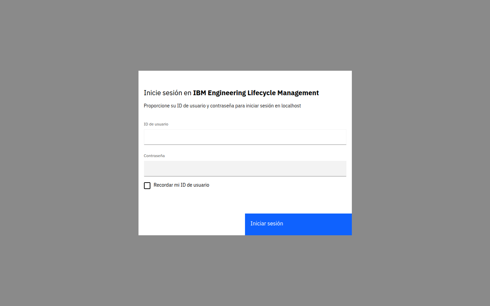
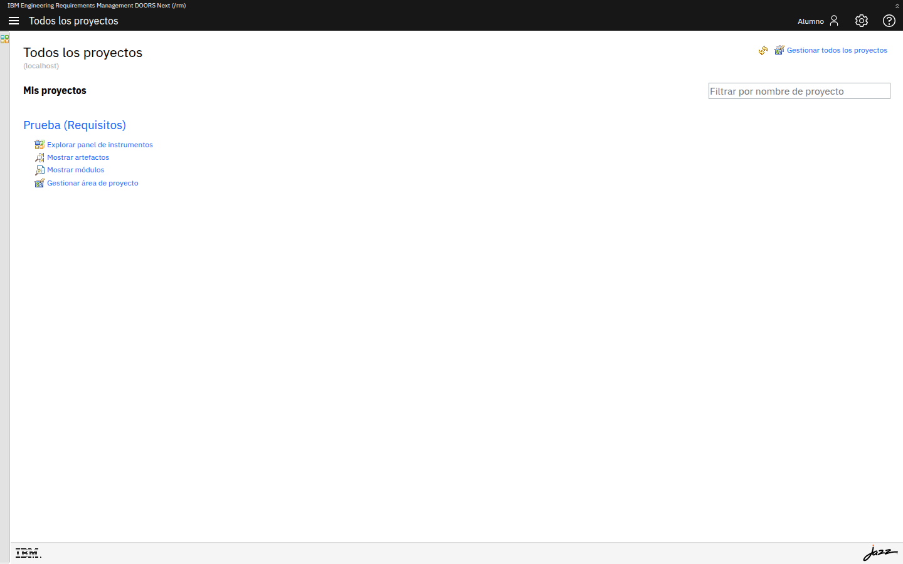
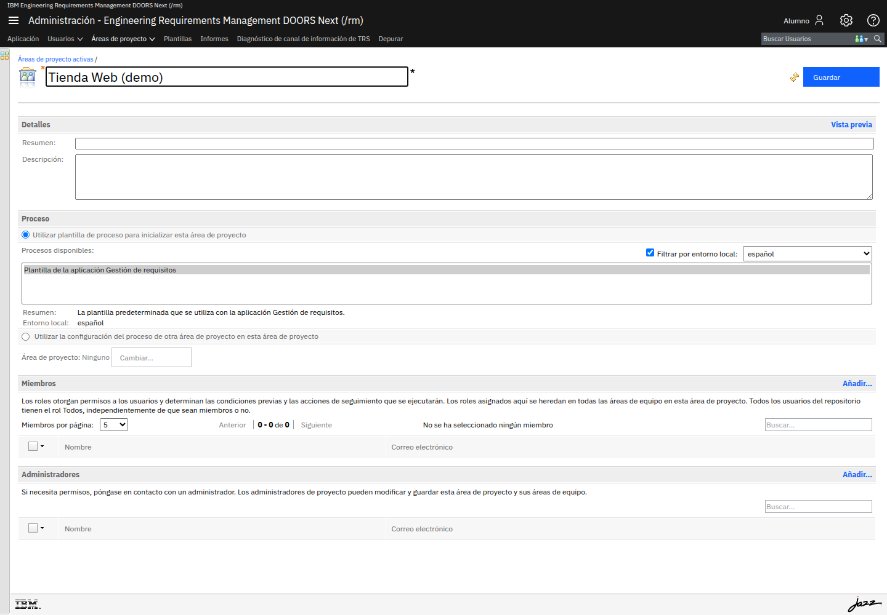
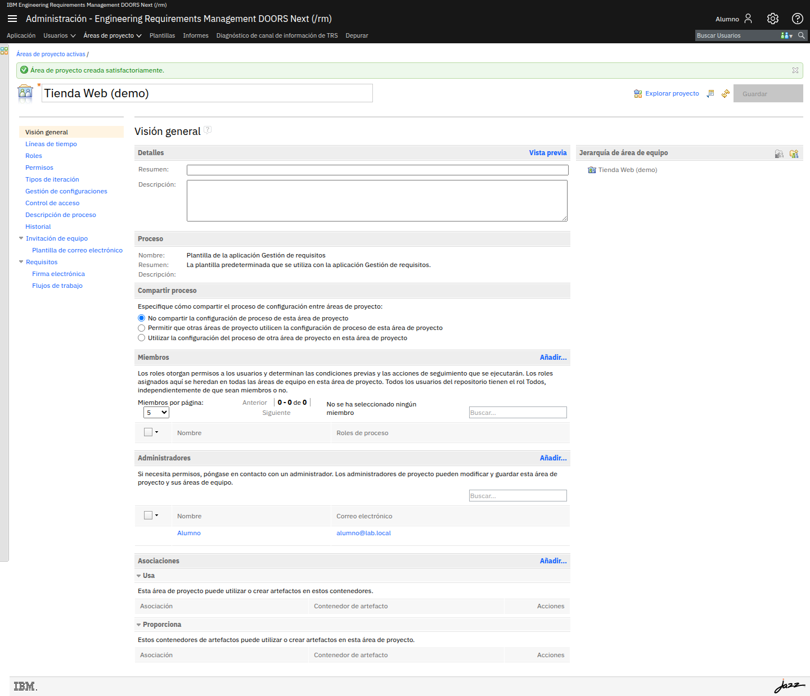
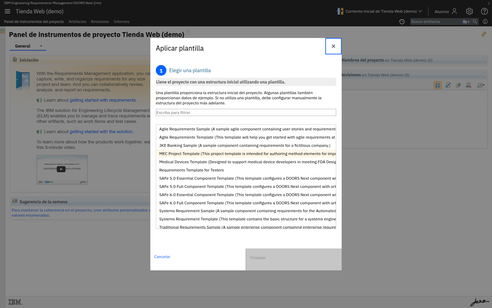
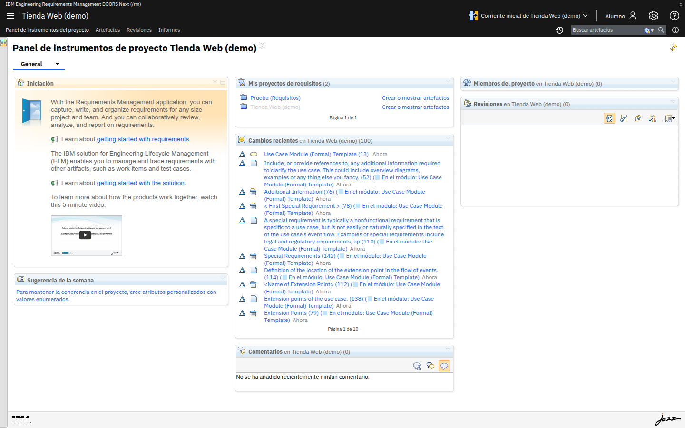

# M01 — Preparar el entorno

[← Página anterior](../../README.md) · [Siguiente página →](M01-02-gestionar-permisos.md)

En este módulo levantas tu propio servidor **IBM DOORS Next**, entras a la
herramienta y preparas **tu proyecto de trabajo**. A partir de aquí trabajarás
siempre contra este entorno.

Elige **una** de las dos opciones de arranque. En ambas accederás por
`https://localhost:9443/rm`.

## Qué aprenderás

- Arrancar DOORS Next + Mailpit con Docker Compose.
- Acceder a la interfaz web e iniciar sesión.
- Crear tu propia área de proyecto y dejarla lista para trabajar.
- Concederte permiso de **autoría** para poder crear módulos y artefactos.

---

## Opción A — Docker en tu equipo

Necesitas **Docker** (Docker Desktop en Windows/macOS, Docker Engine en Linux),
~6-8 GB de RAM libres y el **usuario + token de Docker Hub** que se te facilita.

1. Clona el repositorio y entra:
   ```bash
   git clone https://github.com/my-it-labs/doors-next-101.git
   cd doors-next-101
   ```
2. Inicia sesión en Docker Hub (la contraseña es el **token** que se te facilita):
   ```bash
   docker login -u <USUARIO_DOCKERHUB>
   ```
3. Arranca:
   ```bash
   docker compose -f infra/docker-compose.yml up -d
   ```
4. Espera ~3-4 min (sigue el log hasta `Application rm started`):
   ```bash
   docker compose -f infra/docker-compose.yml logs -f doors
   ```
5. Abre `https://localhost:9443/rm`. **No necesitas reenvío de puerto.**

---

## Opción B — GitHub Codespaces

Necesitas los secretos `DOCKERHUB_USER` y `DOCKERHUB_TOKEN` ya configurados en
**Settings → Codespaces → Secrets**, y reenviar el puerto a tu equipo con
**VS Code de escritorio** o **`gh`**.

1. Haz **fork** de este repositorio.
2. **Code → Codespaces → Create codespace** (máquina **4 núcleos / 16 GB**).
3. En la terminal del Codespace:
   ```bash
   bash infra/up.sh
   ```
4. Espera ~3-4 min:
   ```bash
   docker compose -f infra/docker-compose.yml logs -f doors
   ```
5. **Reenvía el puerto 9443 a tu equipo** y abre `https://localhost:9443/rm`.
   El cómo, según tu sistema operativo, está detallado en
   [infra/README.md](../../infra/README.md#reenvío-de-puerto-opción-b--según-tu-sistema).
   En resumen:
   - **VS Code de escritorio**: *Open in VS Code Desktop* → reenvía el 9443 solo.
   - **GitHub CLI**: `gh codespace ports forward 9443:9443 8025:8025` (deja la
     terminal abierta).

   > **No** abras la URL `*.app.github.dev`: por ahí el inicio de sesión no funciona.

---

## Iniciar sesión

En `https://localhost:9443/rm`, acepta el aviso de **certificado autofirmado** e
inicia sesión con `alumno` / `alumno`.



Al entrar verás la página **Todos los proyectos**. Aquí aparecen los proyectos a
los que tienes acceso y, en el centro de cada uno, los accesos a sus artefactos y
módulos.



---

## Tu proyecto de trabajo

Durante el curso trabajarás en **tu propio proyecto**, del que serás administrador
y autor. Crearlo tiene dos pasos: crear el **área de proyecto** y **aplicar una
plantilla** que le dé los tipos de artefacto.

### 1. Crear el área de proyecto

1. Abre la administración de requisitos en `https://localhost:9443/rm/admin`.
2. Menú **Áreas de proyecto → Área de proyecto** (crear).
3. Pon un nombre (por ejemplo, `Tienda Web - <tu nombre>`) y deja la plantilla de
   proceso **Gestión de requisitos**. Pulsa **Guardar**.



Al guardar, tu usuario queda como **Administrador** del área.



### 2. Aplicar una plantilla de proyecto

Un área recién creada no tiene **tipos de artefacto** todavía. Vuelve a
`https://localhost:9443/rm`, abre tu proyecto y, en el aviso de configuración,
elige **Aplicar una plantilla de proyecto**.

Selecciona **Systems Requirement Template** y confirma con **Finalizar**:



> [!IMPORTANT]
> **Elige una plantilla de requisitos.** Recomendada: **Systems Requirement Template**
> (o *Agile Requirements Template*). Estas traen los **tipos de módulo** que necesitarás
> en M04.
>
> ❌ **No** elijas **MEC**/**MPC** ni las *SAFe Component*: no son de requisitos y tu
> proyecto se quedaría **sin tipo Módulo** (el botón *Crear* no te dejaría crear un módulo).

- Las que terminan en *Template* aportan solo la **estructura y los tipos** (tú
  creas el contenido).
- Las que terminan en *Sample* añaden además **contenido de ejemplo** para explorar
  (p. ej. *JKE Banking Sample*).

Tras aplicarla, el panel del proyecto muestra su contenido.



### 3. Date permiso de autoría

Aunque eres administrador del área, un proyecto recién creado **todavía no te deja crear
artefactos**: hay que concederte el permiso **una vez**. Lo haces, paso a paso, en el
siguiente lab.

→ **[M01-02 · Gestionar permisos](M01-02-gestionar-permisos.md)**

---

## Comprueba

- Ves la página de proyectos de DOORS Next con el usuario `alumno`.
- Tu proyecto aparece en **Todos los proyectos** y puedes abrir sus artefactos.
- Mailpit responde en `http://localhost:8025` (en Codespaces, con el 8025 también
  reenviado).

## Reto

Localiza en la administración (`https://localhost:9443/jts/admin`) la fecha de
caducidad de la licencia de evaluación del servidor.

<details>
<summary>Solución</summary>

En `/jts/admin`, menú **Usuarios → Gestión de licencias de acceso de cliente →
Gestión de claves de licencia**. La columna **Caduca el** muestra la fecha de cada
licencia de prueba activada.
</details>
