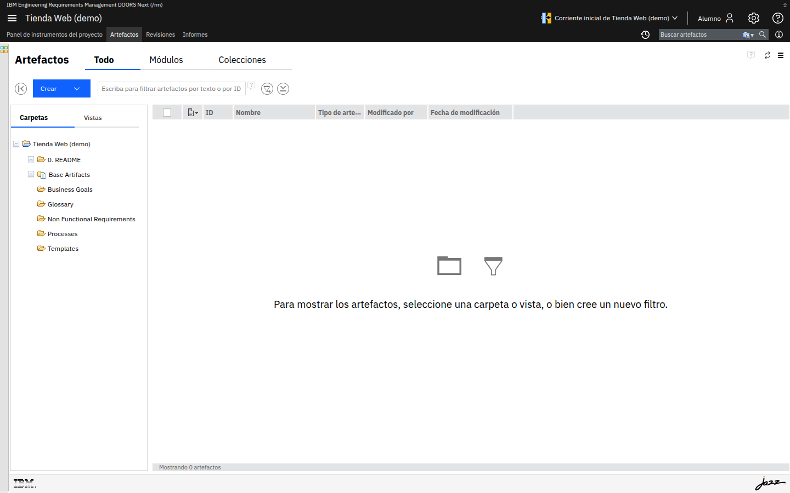

# M02-01 · Clasificar requisitos y explorar artefactos

[← Página anterior](README.md) · [Siguiente página →](../M03-navegacion-estructura/README.md)

> [!NOTE]
> **Objetivo** — clasificar requisitos por **tipo**, juzgar su **calidad** y recorrer la
> organización en **carpetas y artefactos** de un proyecto.
>
> ⏱️ ~15 min · 🗂️ Conceptual + exploración en DOORS Next · 🎯 Resultado: sabes clasificar requisitos y ubicarte en el proyecto.

---

## En qué consiste

Primero trabajas la **teoría** clasificando frases y mejorando una para hacerla verificable.
Después abres DOORS Next y recorres la estructura de **carpetas y artefactos** de un proyecto.

## Antes de empezar necesitas

- Haber repasado la teoría del módulo → [M02 · Fundamentos](README.md#1-teoría).
- Tu proyecto con una plantilla aplicada (de M01) o el proyecto de ejemplo.

---

## Parte A · Clasifica y mejora requisitos

**Acción** — para cada frase, asigna **tipo** (negocio / funcional / no funcional) y decide si
es **verificable**:

> 1. "El sistema permitirá iniciar sesión con usuario y contraseña."
> 2. "La aplicación debe ser rápida."
> 3. "El catálogo mostrará los productos disponibles."
> 4. "Queremos aumentar las ventas online."

> [!NOTE]
> **Por qué** — el tipo condiciona **dónde vive** el requisito y **con qué se enlaza**.

Ver solución

 

1 y 3 → **funcionales** · 2 → **no funcional** · 4 → **de negocio**.

**Acción** — reescribe la frase **2** para hacerla **verificable**.

> [!TIP]
> "Rápida" no es medible. Una versión verificable sería algo como
> *"el catálogo responde en menos de 2 s con 1000 productos"*.

---

## Parte B · Explora la estructura del proyecto

**Acción** — abre **Artefactos** y despliega el árbol de **Carpetas**.

> [!NOTE]
> **Por qué** — la organización en carpetas es la base para **encontrar y ordenar** requisitos.
> **Resultado esperado:** ves carpetas como *Business Goals*, *Glossary*, *Non Functional
> Requirements*, *Processes*, *Templates*.

**Acción** — cambia entre las pestañas **Todo** y **Módulos**.

> [!NOTE]
> **Por qué** — un módulo es un tipo especial de artefacto (un documento) y se lista aparte.
> **Resultado esperado:** en **Módulos** aparecen solo los artefactos de tipo módulo.

---

## ✅ Resultado

- Sabes clasificar un requisito por **tipo** y aplicar el filtro de **verificabilidad**.
- Reconoces la organización del proyecto en **carpetas y artefactos** y dónde se listan los módulos.

## Comprueba

- [ ] Has etiquetado las 4 frases y reescrito la nº 2 de forma verificable.
- [ ] Sabes en qué pestaña verías un **documento de requisitos** completo (Módulos).
- [ ] Localizas la columna que identifica de forma única cada artefacto (**ID**).

## 🏆 Reto

Escribe un requisito **no funcional de seguridad** para un login, redactado de forma verificable.

Ver solución

 

Por ejemplo: *"Tras 5 intentos fallidos de inicio de sesión en 5 minutos, la cuenta se
bloquea durante 15 minutos"*. Es **medible** y **comprobable**.

