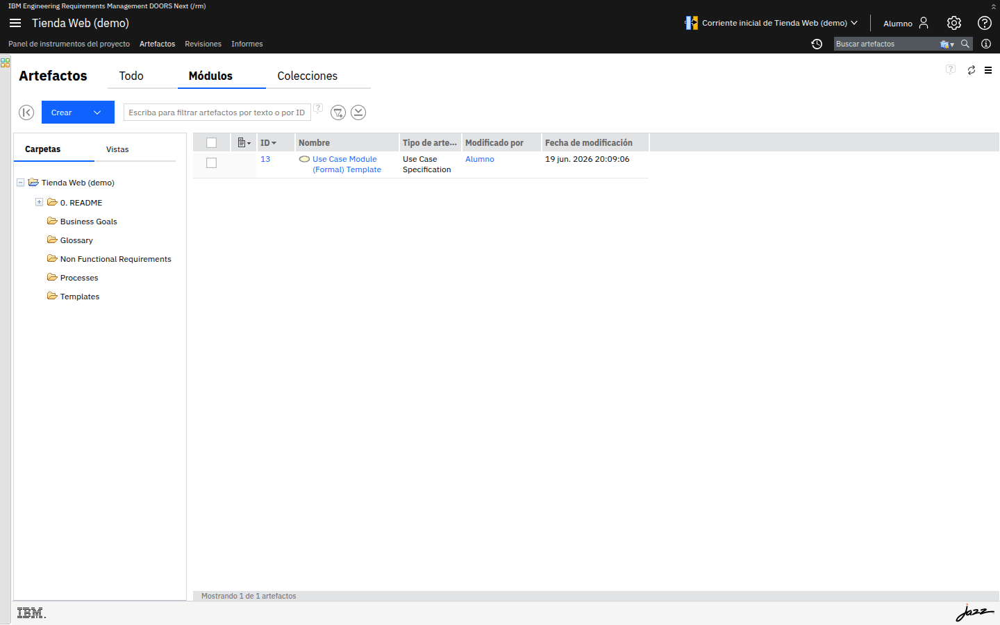
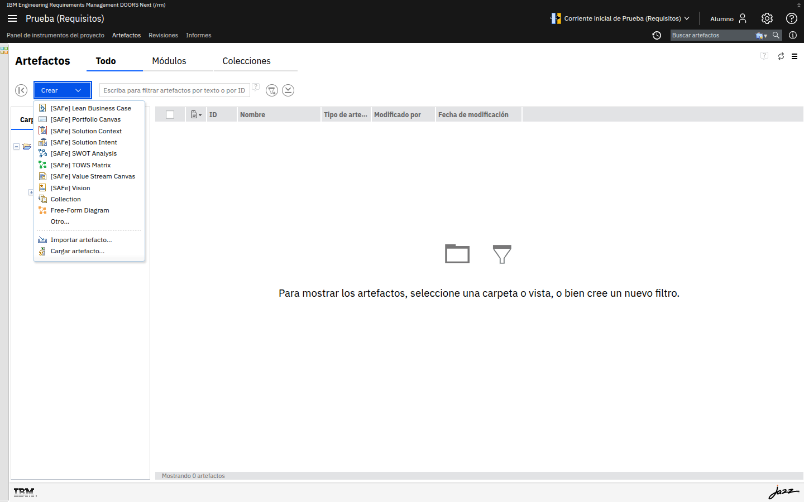
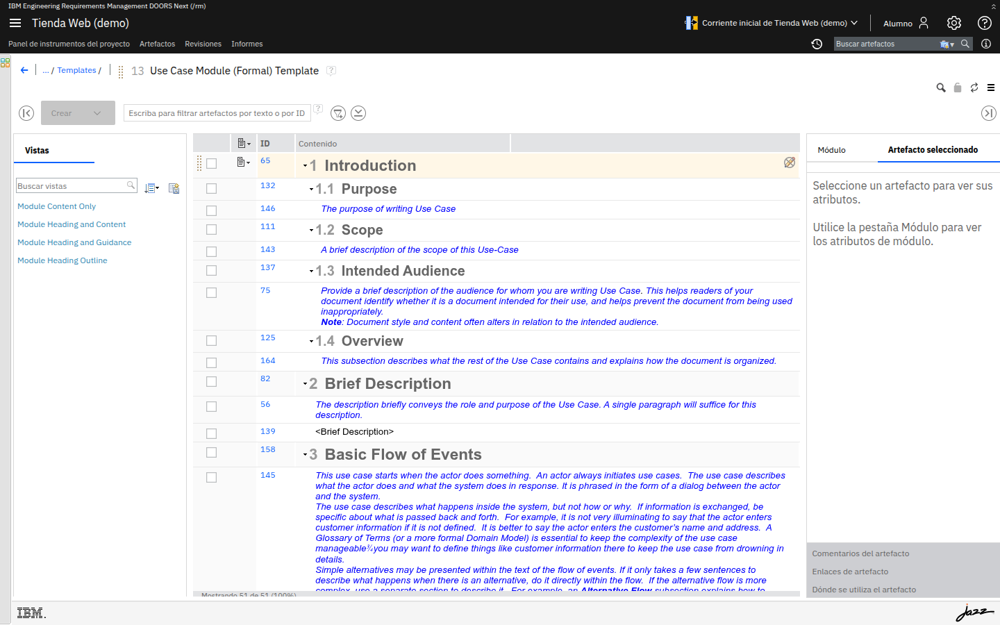
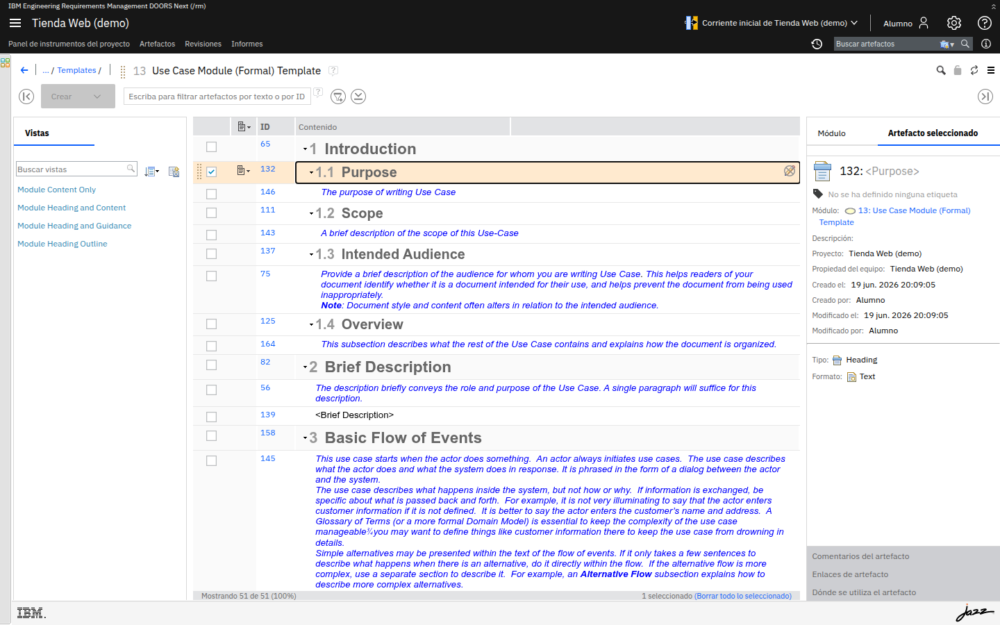
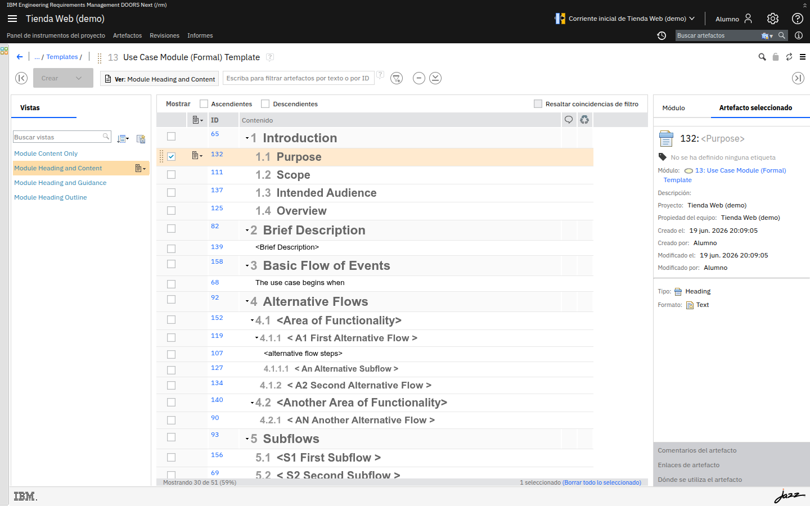

# M03 — DOORS Next: navegación y estructura

[← Página anterior](../M02/README.md) · [Siguiente página →](../../README.md)

Este módulo es el recorrido operativo por la herramienta: cómo moverte por el
proyecto, abrir un **módulo** y entender su jerarquía y atributos, y cómo usar
**vistas y filtros** para mirar la información de distintas formas.

## Qué aprenderás

- Navegar por Artefactos, Módulos y Colecciones de un proyecto.
- Abrir un módulo y leer su jerarquía, numeración e identificadores.
- Consultar los atributos de un artefacto.
- Aplicar y reconocer vistas y filtros.

## Tabla de ejercicios

- M03-01 — Navegación general y estructura del proyecto
- M03-02 — El módulo: jerarquía, numeración y atributos
- M03-03 — Vistas y filtros

---

## M03-01 — Navegación general y estructura del proyecto

### Objetivos

- Identificar las áreas principales de un proyecto de requisitos.
- Localizar módulos y artefactos.

### Conceptos

- **Artefactos / Todo:** todos los artefactos del proyecto.
- **Módulos:** los artefactos de tipo módulo (documentos de requisitos).
- **Colecciones:** agrupaciones de artefactos para revisar o publicar.
- **Carpetas:** organizan los artefactos; las **Vistas** guardan formas de listarlos.

### En DOORS Next

La pestaña **Módulos** lista los módulos del proyecto con su ID, nombre y tipo. El
desplegable **Crear** permite añadir nuevos módulos, artefactos o colecciones.

El menú **Crear** muestra los tipos disponibles según la plantilla aplicada al
proyecto.

### Laboratorio

**Objetivo:** recorrer las tres pestañas y localizar el módulo de trabajo.

**En qué consiste:** sobre tu proyecto, navega por Artefactos, Módulos y Colecciones.

- **Acción:** abre la pestaña **Módulos**.
  **Por qué:** es donde se trabaja con documentos de requisitos completos.
  **Resultado esperado:** ves al menos un módulo listado con su **ID** y **Tipo de
  artefacto**.
- **Acción:** abre el desplegable **Crear**.
  **Por qué:** los tipos ofrecidos dependen de la plantilla del proyecto.
  **Resultado esperado:** aparecen opciones como *Module* y tipos de artefacto.

### Conclusiones

- El proyecto separa la información en Artefactos, Módulos y Colecciones.
- Lo que puedes crear depende de la plantilla aplicada en M01.

### Comprueba

- ¿Qué pestaña usarías para abrir un documento de requisitos con su estructura
  completa?

### Reto

Averigua cuántos artefactos contiene el módulo del proyecto sin abrirlo del todo.

Solución

En la lista de **Módulos**, la columna y el pie de la tabla indican el recuento;
al abrir el módulo, el pie muestra "Mostrando N de N".

---

## M03-02 — El módulo: jerarquía, numeración y atributos

### Objetivos

- Leer la jerarquía y la numeración de un módulo.
- Consultar los atributos de un artefacto seleccionado.

### Conceptos

- Un **módulo** presenta los artefactos como un documento, con **secciones**
  (encabezados) y **requisitos**, ordenados en una **jerarquía** con numeración
  automática (1, 1.1, 1.1.1…).
- Cada fila tiene un **ID** estable que identifica el artefacto, independientemente
  de su posición.
- El panel lateral muestra los **atributos** del artefacto seleccionado.

### En DOORS Next

Al abrir un módulo, la columna **Contenido** muestra la jerarquía con su numeración
y la columna **ID** el identificador de cada artefacto. A la izquierda está el panel
de **Vistas**; a la derecha, el de **Módulo / Artefacto seleccionado**.

Al seleccionar un artefacto, el panel **Artefacto seleccionado** muestra sus
atributos: módulo al que pertenece, proyecto, creado/modificado por y cuándo, tipo
(p. ej. *Heading*) y formato, además de accesos a **comentarios**, **enlaces** y
**dónde se utiliza**.

### Laboratorio

**Objetivo:** recorrer la jerarquía y leer los atributos de un artefacto.

**En qué consiste:** sobre el módulo del proyecto, observa estructura y atributos.

- **Acción:** abre el módulo desde la pestaña **Módulos**.
  **Por qué:** es la vista de trabajo principal sobre requisitos.
  **Resultado esperado:** ves encabezados numerados (1, 1.1, 1.2…) y requisitos.
- **Acción:** selecciona un encabezado y luego un requisito.
  **Por qué:** los atributos cambian según el artefacto.
  **Resultado esperado:** el panel derecho muestra Tipo, autor, fechas y enlaces del
  artefacto seleccionado.

### Conclusiones

- La numeración refleja la jerarquía, pero el **ID** es lo que identifica de forma
  estable a cada artefacto.
- Los atributos viven en el artefacto y se consultan en el panel lateral.

### Comprueba

- Si mueves un requisito a otra sección, ¿cambia su **ID**?

### Reto

Encuentra, para un artefacto, dónde verías sus **enlaces** y **dónde se utiliza**.

Solución

En el panel **Artefacto seleccionado**, en la parte inferior: **Enlaces de
artefacto** y **Dónde se utiliza el artefacto**.

---

## M03-03 — Vistas y filtros

### Objetivos

- Aplicar una vista guardada.
- Entender filtros y columnas como forma de mirar los mismos datos.

### Conceptos

- Una **vista** guarda una configuración de columnas, filtros y orden.
- Cambiar de vista no modifica los datos: solo cambia **cómo se muestran**.
- Los **filtros** acotan qué artefactos se ven (por atributo, tipo, texto…).

### En DOORS Next

El panel **Vistas** ofrece vistas guardadas (p. ej. *Module Content Only*, *Module
Heading and Content*, *Module Heading Outline*). Al aplicar una, la barra superior
indica **Ver: <nombre de la vista>** y la tabla se reordena según esa configuración.

### Laboratorio

**Objetivo:** cambiar entre vistas y observar el efecto.

**En qué consiste:** sobre el módulo abierto, prueba varias vistas guardadas.

- **Acción:** en el panel **Vistas**, aplica *Module Heading Outline*.
  **Por qué:** muestra solo la estructura de encabezados.
  **Resultado esperado:** se ven los encabezados sin el cuerpo de los requisitos.
- **Acción:** aplica *Module Heading and Content*.
  **Por qué:** combina encabezados y contenido.
  **Resultado esperado:** la barra superior indica **Ver: Module Heading and
  Content** y se muestran ambos.

### Conclusiones

- Las vistas son la forma de adaptar la presentación al objetivo (revisar, exportar,
  analizar) sin tocar los datos.
- Los filtros y columnas son la base para las matrices y la trazabilidad que verás
  más adelante.

### Comprueba

- ¿Aplicar una vista distinta cambia el contenido del módulo o solo su presentación?

### Reto

Identifica en la barra superior del módulo cómo saber **qué vista** está aplicada en
cada momento.

Solución

La barra superior muestra **Ver: <nombre de la vista>** junto al selector de vistas;
si no hay vista aplicada, aparece la vista por defecto.

