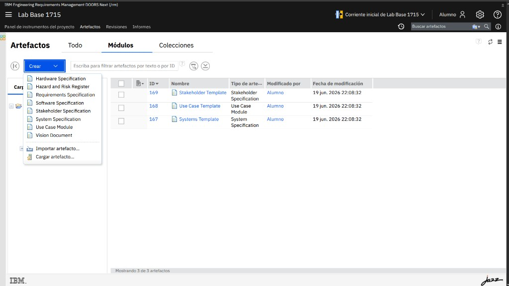
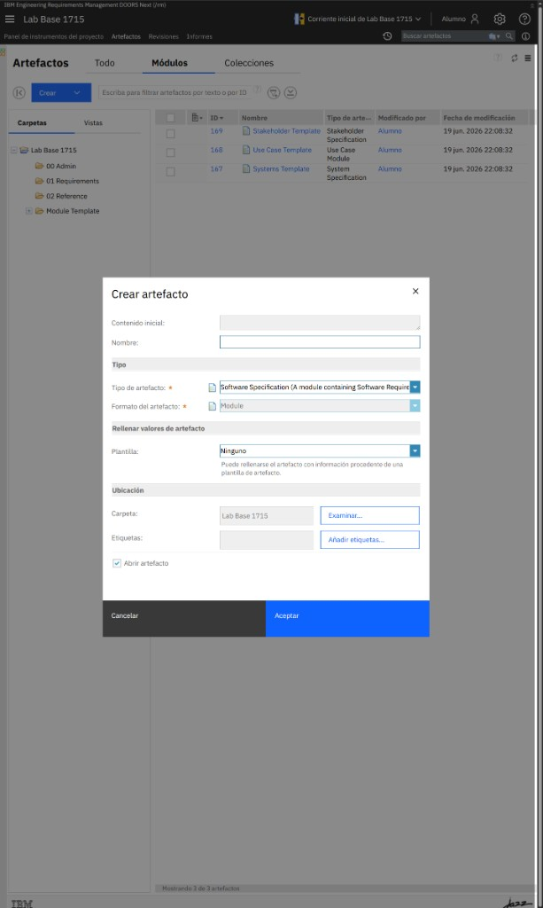
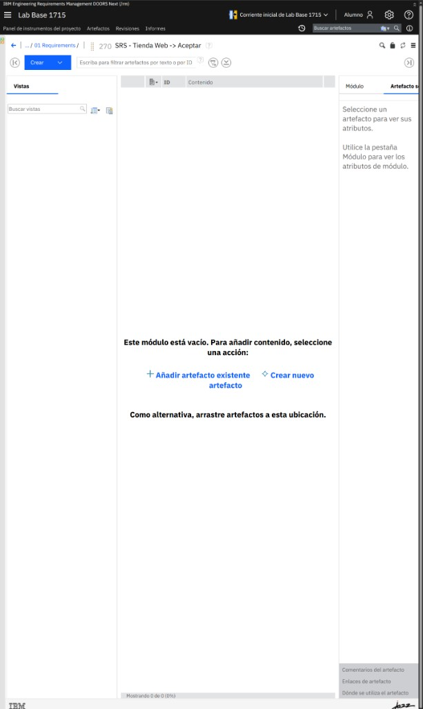
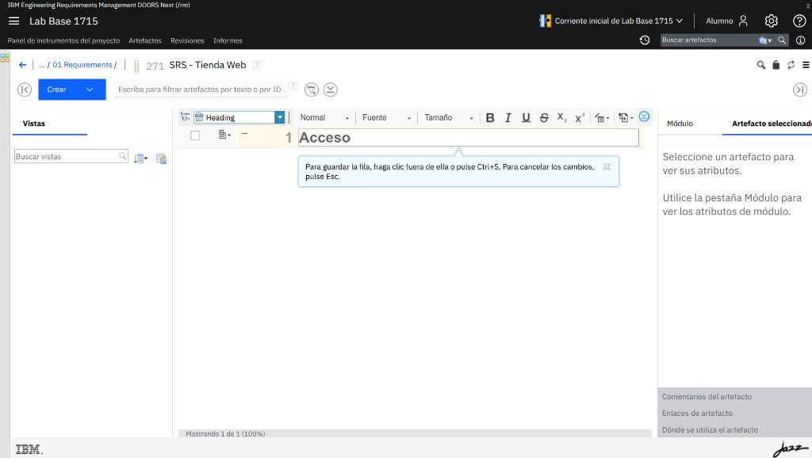
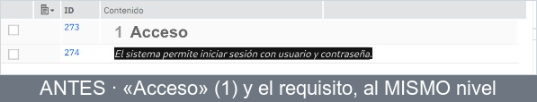
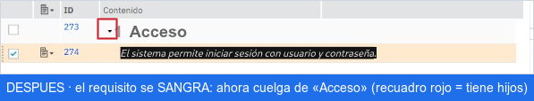

# M04-01 · Crear un módulo y su jerarquía

[← Página anterior](README.md) · [Siguiente página →](M04-02-atributos-estados.md)

> [!NOTE]
> **Objetivo** — crear desde cero un módulo de requisitos y montar una pequeña
> jerarquía de encabezados y requisitos, entendiendo cómo nace la numeración.
>
> ⏱️ ~15 min · 🗂️ Trabajas en **tu** proyecto · 🎯 Resultado: un documento numerado.

---

## En qué consiste

Vas a crear un **módulo** llamado `SRS - Tienda Web` y, dentro, tres secciones
—Acceso, Catálogo y Carrito— con un requisito cada una.

Al terminar tendrás un documento de requisitos navegable y numerado.

## Antes de empezar necesitas

- El entorno arrancado y sesión iniciada como `alumno` → [M01](../M01-preparar-entorno/README.md).
- **Tu propio proyecto** con una plantilla aplicada → [M01 · Tu proyecto de trabajo](../M01-preparar-entorno/README.md#tu-proyecto-de-trabajo).

> [!IMPORTANT]
> Trabaja **siempre dentro de tu proyecto**, donde eres autor. En proyectos ajenos
> no podrás crear y verás un aviso de "No está autorizado".

---

## Conceptos en 30 segundos

| Término | Qué es |
|---|---|
| **Módulo** | Un artefacto que muestra otros artefactos como un **documento** (filas, sangrías, numeración). |
| **Encabezado** | Estructura: el título de una sección. **No** es un requisito. |
| **Requisito** | El contenido que el sistema debe cumplir. |
| **ID** | Identificador único de cada fila (p. ej. `132`). **Nunca cambia.** |
| **Numeración** | El `1`, `1.1`, `1.1.1`… **automático**, depende solo de la sangría. |

---

## Paso a paso

### Paso 1 · Abre tu proyecto en la pestaña Módulos

**Acción** — entra en `https://localhost:9443/rm`, abre **tu** proyecto y pulsa
**Artefactos**. Luego, en la fila de pestañas, pulsa **Módulos**.

**Qué ves** — la cabecera con el nombre del proyecto y las pestañas
**Todo · Módulos · Colecciones**. A la izquierda, el árbol de **Carpetas**.

> [!TIP]
> **Opciones** — la pestaña **Todo** muestra todos los artefactos; **Módulos** filtra
> solo los documentos. Trabajaremos en **Módulos**.

---

### Paso 2 · Abre el menú Crear

**Acción** — pulsa el botón azul **Crear** (arriba a la izquierda, con la flecha ▾).



**Qué ves** — un desplegable con los **tipos de artefacto** de tu plantilla y, abajo,
**Importar artefacto…** y **Cargar artefacto…**. Todavía no se crea nada.

> [!TIP]
> **Opciones** — los nombres dependen de la plantilla. En una básica verás **Module**;
> en otras, tipos con nombre propio (p. ej. *Use Case Specification*). Elige el que
> represente un **módulo**.

> [!NOTE]
> **Por qué** — DOORS Next no tiene un único "nuevo documento": lo que puedes crear lo
> define la **plantilla** que aplicaste en M01.

---

### Paso 3 · Elige el tipo módulo y abre el diálogo

**Acción** — en el menú, haz clic en el tipo **módulo** de tu plantilla.



**Qué ves** — el diálogo **Crear artefacto**:

| Campo | Para qué |
|---|---|
| **Nombre** `*` | El nombre del módulo (obligatorio). |
| **Tipo de artefacto** | Ya viene **Module** (una jerarquía de artefactos). |
| **Formato del artefacto** | **Module**. |
| **Plantilla** | **Ninguno** (puedes partir de una plantilla de artefacto; aquí no). |
| **Ubicación → Carpeta** | Dónde se guarda. |
| **Abrir artefacto** | Marcado: se abrirá al crearlo. |

> [!WARNING]
> Si **Aceptar** sale en gris y ves **"No está autorizado para crear…"**, tu usuario aún no
> tiene permiso de autoría en el proyecto. Se resuelve una sola vez en
> [M01 · Gestionar permisos](../M01-preparar-entorno/M01-02-gestionar-permisos.md).

---

### Paso 4 · Da nombre y crea el módulo

**Acción** — en **Nombre** escribe `SRS - Tienda Web`, deja **Abrir artefacto**
marcado y pulsa **Aceptar**.

**Qué pasa** — el diálogo se cierra y, tras unos segundos, se abre el **editor del
módulo** (vacío), con la ruta y el nombre en la cabecera.



**Qué ves** — un módulo vacío que te ofrece **➕ Añadir artefacto existente** o
**◇ Crear nuevo artefacto**. Vas a crear contenido nuevo.

> [!NOTE]
> **Por qué** — "SRS" (*Software Requirements Specification*) es el nombre habitual de
> un documento de requisitos; nombrarlo bien te ayuda a encontrarlo después.

---

### Paso 5 · Añade el primer encabezado

**Acción** — pulsa **◇ Crear nuevo artefacto** (o el botón **Crear** de la barra del
módulo). Aparece una **fila en edición**: escribe `Acceso`.



**Qué ves** — una fila editable con un **selector de tipo** (arriba a la izquierda, p. ej.
**Heading**), la barra de texto enriquecido y el aviso *"Para guardar la fila, haga clic
fuera o pulse Ctrl+5"*. Al ser la primera de primer nivel, su número será **1**.

**Acción** — guarda la fila: **haz clic fuera** de ella o pulsa <kbd>Ctrl</kbd>+<kbd>5</kbd>.

> [!TIP]
> **Opciones** — el selector de tipo te deja elegir **Heading** (encabezado/estructura) o un
> tipo de **requisito**. Para una sección, usa **Heading**.

> [!NOTE]
> **Por qué** — separar **estructura** (encabezados) de **contenido** (requisitos) es
> lo que convierte una lista en un documento legible.

---

### Paso 6 · Añade un requisito

**Acción** — pulsa **Crear** otra vez para añadir una segunda fila. En el **selector de
tipo** elige un tipo de **requisito** (p. ej. *Software Requirement*) y escribe:

> `El sistema permite iniciar sesión con usuario y contraseña`

Guárdala (**clic fuera** o <kbd>Ctrl</kbd>+<kbd>5</kbd>).

**Qué ves** — una segunda fila, de momento **al mismo nivel** que "Acceso"
(numerada **2**). Falta meterla dentro de la sección 👇.

---

### Paso 7 · Indenta el requisito (crea la jerarquía)

De partida, el encabezado y el requisito están **al mismo nivel** (son "hermanos"):



**Acción** — selecciona la fila del **requisito** y aplícale sangría:
- clic derecho → **Disminuir nivel de artefacto** (<kbd>Alt</kbd>+<kbd>Shift</kbd>+<kbd>→</kbd>), o
- el botón **Aumentar sangría** (➡️) de la barra del módulo.



**Qué ves** — el requisito se **desplaza a la derecha** y pasa a colgar de "Acceso".
Fíjate en que "Acceso" muestra ahora un **triángulo ▾** (señal de que tiene hijos y se
puede plegar). Internamente, su **número de sección** pasa de **2** a **1.1**; si no lo ves,
puedes mostrarlo como **columna** (lo verás en M04-02).

> [!IMPORTANT]
> **Implicación clave** — la numeración (`1.1`) es **consecuencia** de la jerarquía,
> no algo que escribas. Si reorganizas el documento, los números se ajustan solos…
> pero el **ID no cambia nunca**. Por eso, para referirte a un requisito de forma
> estable, se usa su **ID**, no su número.

> [!TIP]
> **Opciones** — **Reducir sangría** (⬅️) lo sube de nivel; **subir/bajar** reordenan
> filas del mismo nivel.

---

### Paso 8 · Repite para Catálogo y Carrito

**Acción** — crea dos encabezados más al **primer nivel** (`Catálogo`, `Carrito`) y,
bajo cada uno, un requisito **indentado**:

- **Catálogo** → `El catálogo muestra los productos disponibles con su precio`
- **Carrito** → `El carrito permite añadir y quitar productos antes de pagar`

**Qué ves** — una numeración limpia: **1 / 1.1**, **2 / 2.1**, **3 / 3.1**.

---

## ✅ Resultado

```text
1     Acceso
1.1     El sistema permite iniciar sesión con usuario y contraseña
2     Catálogo
2.1     El catálogo muestra los productos disponibles con su precio
3     Carrito
3.1     El carrito permite añadir y quitar productos antes de pagar
```

Así se ve una jerarquía numerada real dentro del editor de módulo —fíjate en la
columna **ID** (estable) frente a la **numeración** `1 / 1.1 / 1.1.1` (calculada):


## Comprueba

- [ ] El módulo aparece en la pestaña **Módulos**.
- [ ] Cada fila tiene un **ID**.
- [ ] La numeración refleja la jerarquía (1, 1.1, 2, 2.1, 3, 3.1).
- [ ] Plegar un encabezado oculta sus requisitos hijos.

## Errores frecuentes

> [!WARNING]
> - **"No está autorizado para crear…"** → no eres autor del proyecto. Usa **tu**
>   proyecto (el de M01).
> - **El número no cambia al indentar** → no tenías seleccionado el requisito;
>   selecciónalo y vuelve a aumentar la sangría.
> - **No veo el botón Crear dentro del módulo** → el módulo debe estar **abierto**
>   (editor), no en la lista de módulos.

## 🏆 Reto

Crea un requisito y **muévelo** de "Catálogo" a "Carrito". Observa qué cambia y qué no.

<details>
<summary>Ver solución</summary>

<br>

Cambia su **numeración** (pasa a colgar de la nueva sección, p. ej. de `2.1` a `3.2`)
porque depende de la posición. Su **ID no cambia**: sigue siendo el mismo artefacto,
solo en otro sitio del documento.

</details>
