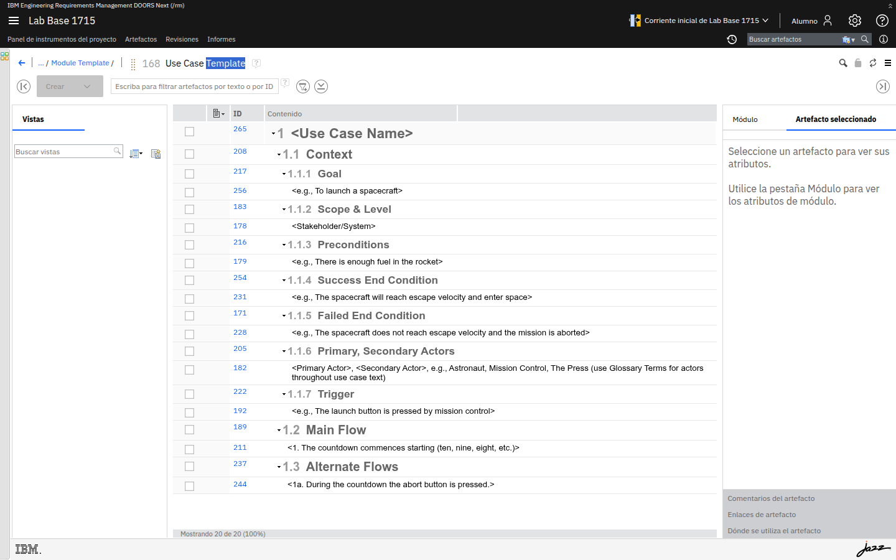
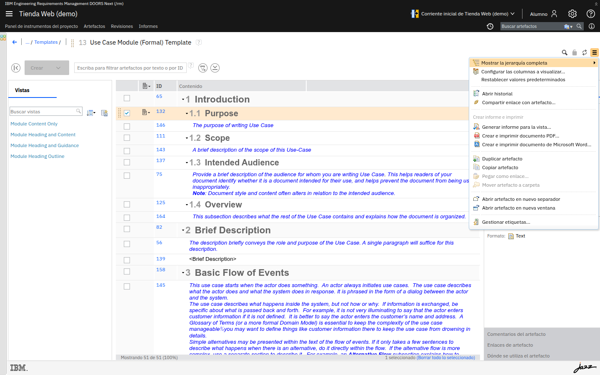

# M04 — Creación y mantenimiento de requisitos

[← Página anterior](../M03-navegacion-estructura/README.md) · [Siguiente página →](M04-01-crear-modulo.md)

Hasta ahora has navegado por contenido existente. En este módulo **creas** tú:
un módulo, sus secciones y sus requisitos, con jerarquía y numeración, y aprendes a
mantenerlos con tipos, atributos y estados.

> [!NOTE]
> **Cómo funciona este módulo** — primero la **teoría** (sección 1) y una
> **demostración guiada** de principio a fin (sección 2). Después **practicas tú** con los
> dos laboratorios (sección 3): unos minutos por lab, recapitulamos y seguimos.

## Qué aprenderás

- Crear un módulo en tu proyecto y añadirle encabezados y requisitos.
- Organizar la jerarquía (indentar/desindentar) y entender la numeración.
- Usar tipos de artefacto, atributos (como columnas) y estados (flujo de trabajo).

---

## 1. Teoría

### Módulo, artefacto, encabezado y requisito

- Un **módulo** es un artefacto especial que presenta otros artefactos como un **documento**
  (con su orden y su jerarquía).
- Dentro del módulo, cada fila es un **artefacto**. Hay dos papeles típicos:
  - **Encabezado** (*Heading*) — da **estructura** (secciones, apartados). No es un requisito.
  - **Requisito** — el **contenido** que hay que cumplir (lo que el sistema debe hacer).

| Elemento | Para qué sirve | Ejemplo |
|---|---|---|
| **Módulo** | Agrupar y ordenar artefactos como documento | *SRS - Tienda Web* |
| **Encabezado** | Estructurar en secciones | `Acceso`, `Catálogo` |
| **Requisito** | Expresar una necesidad verificable | *El sistema permite iniciar sesión…* |

### Jerarquía, numeración e ID

- La **jerarquía** se controla **indentando** (sangrando) las filas: un requisito dentro de
  un encabezado "cuelga" de él.
- La **numeración** (`1`, `1.1`, `1.1.1`…) **se recalcula sola** según la posición. No la
  escribes tú.
- El **ID** de cada artefacto es **estable**: no cambia aunque muevas o reordenes la fila.

> [!IMPORTANT]
> Para referirte a un requisito de forma fiable usa su **ID**, no su número: el número
> depende de la posición; el ID, no.

### Tipo, atributos y estado

- El **tipo de artefacto** (Heading, Requirement…) determina **qué atributos** tiene.
- Los **atributos** son los datos del artefacto: unos los pone el sistema (ID, autor,
  fechas) y otros vienen de la **plantilla** (Prioridad, Riesgo, **Estado**…).
- El **estado** es un atributo especial gobernado por un **flujo de trabajo**: solo permite
  ciertas transiciones (p. ej. *Borrador → Revisión → Aprobado*), controlando la madurez.

| Concepto | Idea clave |
|---|---|
| **Tipo** | Define los atributos disponibles del artefacto. |
| **Atributo** | Dato del artefacto; editable también **como columna** en la tabla. |
| **Estado** | Avanza solo por las transiciones del flujo de trabajo. |

---

## 2. Demostración guiada

> [!NOTE]
> Recorrido completo, de principio a fin, que **vemos juntos** antes de que lo hagas tú. El
> detalle paso a paso, con **todas las capturas**, está en los laboratorios de la sección 3.

### A · Crear el módulo y su jerarquía  → se practica en [M04-01](M04-01-crear-modulo.md)

1. En tu proyecto, **Artefactos → Módulos → Crear** y elige un tipo de módulo.
2. Se abre el **editor del módulo**, vacío.
3. Crea un **encabezado** (`Acceso`) y, debajo, un **requisito**
   (*El sistema permite iniciar sesión con usuario y contraseña*).
4. **Indenta** el requisito: su número pasa de `2` a `1.1` y "cuelga" de *Acceso*.
5. Repite con `Catálogo` y `Carrito`. Observa cómo la **numeración** se ajusta sola y cada
   fila mantiene su **ID**.

### B · Atributos como columnas y estado  → se practica en [M04-02](M04-02-atributos-estados.md)

1. Selecciona un requisito y abre el panel **Artefacto seleccionado**: ID, tipo, autor,
   fechas… Compara con un **encabezado** (tiene menos atributos).
2. En **Más acciones (▤) → Configurar las columnas a visualizar…**, añade una columna de
   atributo (p. ej. **Prioridad** o **Estado**).
3. Edita ese atributo **directamente en la columna**, en varias filas de un vistazo.
4. Cambia el **estado** de un requisito (p. ej. *Borrador → Revisión*) y comprueba que el
   flujo **no deja saltarse pasos**.

---

## 3. Ahora practica tú

> [!IMPORTANT]
> **Dinámica** — haz cada laboratorio por tu cuenta (unos **15 min** cada uno). Al terminar,
> lo **recapitulamos** en común y continuamos con el siguiente.

| Lab | Título | Qué harás | Tiempo |
|-----|--------|-----------|--------|
| [M04-01](M04-01-crear-modulo.md) | Crear un módulo y su jerarquía | Crear el módulo, añadir encabezados y requisitos, indentar y ver la numeración | ~15 min |
| [M04-02](M04-02-atributos-estados.md) | Tipos, atributos y estados | Editar atributos como columnas y cambiar el estado de un requisito | ~15 min |

→ Empieza por **[M04-01 — Crear un módulo y su jerarquía](M04-01-crear-modulo.md)**.
