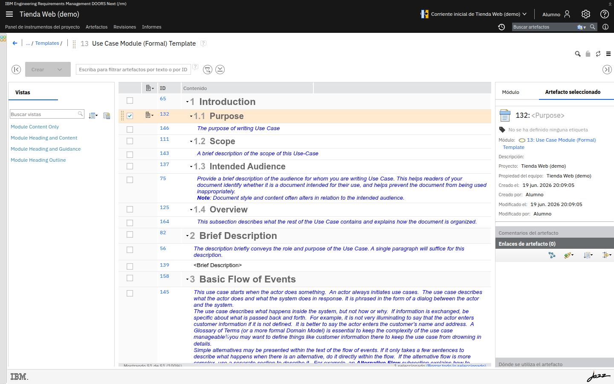

# M05 · Trazabilidad operativa

[← Página anterior](../M04-creacion-mantenimiento/M04-02-atributos-estados.md) · [Siguiente página →](../M06-control-cambios/README.md)

La trazabilidad conecta requisitos entre sí (y con diseño y pruebas) mediante **enlaces
tipados**. Sobre esos enlaces se construyen las **matrices de trazabilidad** y el **análisis
de impacto**.

## Qué aprenderás

- Crear **enlaces tipados** entre artefactos.
- Leer una **vista/matriz** de trazabilidad.
- Hacer un **análisis de impacto** a partir de los enlaces.

## Ejercicios de este módulo

| Lab | Título |
|-----|--------|
| M05-01 | Enlaces tipados entre artefactos |
| M05-02 | Matriz de trazabilidad y análisis de impacto |

---

## M05-01 · Enlaces tipados entre artefactos

> [!NOTE]
> **Objetivo** — crear un enlace entre dos artefactos y distinguir su **tipo** y su **dirección**.

### Conceptos clave

| Concepto | Qué es |
|---|---|
| **Enlace** | Relaciona dos artefactos. |
| **Tipo** | Da el significado: *Deriva de*, *Satisface*, *Está validado por*, *Refina*… |
| **Dirección** | Origen → destino; se recorre en ambos sentidos. |
| **Dónde se utiliza** | Apartado del artefacto que muestra desde dónde se le referencia. |

### En DOORS Next

En el panel **Artefacto seleccionado**, la sección **Enlaces de artefacto** lista los enlaces
existentes (con un contador) y ofrece la barra para **crear** uno nuevo (tipo + artefacto destino).

El apartado **Dónde se utiliza el artefacto** ayuda a ver desde dónde se referencia.

### Laboratorio

**Acción** — selecciona un artefacto y abre **Enlaces de artefacto**.

> [!NOTE]
> **Por qué** — los enlaces se gestionan **desde el artefacto**.
> **Resultado esperado:** ves la sección de enlaces (con su contador) y la barra de creación.

**Acción** — crea un enlace, elige un **tipo** (p. ej. *Deriva de*) y el artefacto destino.

> [!IMPORTANT]
> **Implicación** — el **tipo** aporta el significado de la relación; el enlace aparece en
> **ambos** artefactos, en sentidos opuestos.

## ✅ Conclusiones

- La trazabilidad es la **red de enlaces tipados**; sin tipo, un enlace no comunica intención.
- Cada enlace es **navegable** en los dos sentidos.

## Comprueba

- [ ] Sabes qué ocurre con los enlaces si borras un requisito enlazado.

## 🏆 Reto

Elige el tipo de enlace adecuado para expresar que *"una prueba **verifica** un requisito"*.

Ver solución

 

Un enlace **Validado por / Está validado por** (o *Verifica*, según la plantilla) entre el
requisito y el caso de prueba. La **dirección** distingue qué valida a qué.

---

## M05-02 · Matriz de trazabilidad y análisis de impacto

> [!NOTE]
> **Objetivo** — leer una vista/matriz de trazabilidad y estimar el **impacto** de un cambio
> recorriendo enlaces.

### Conceptos clave

| Concepto | Qué es |
|---|---|
| **Vista de trazabilidad** | Añade columnas con los artefactos enlazados: se ve, fila a fila, qué está cubierto. |
| **Matriz** | Cruza dos conjuntos de artefactos y marca dónde hay enlace. |
| **Análisis de impacto** | Dado un artefacto, seguir sus enlaces para saber qué afectaría un cambio. |

### En DOORS Next

Las **vistas** pueden incluir **columnas de enlaces** que muestran los artefactos relacionados.
Los **huecos** (filas sin enlace donde debería haberlo) señalan falta de cobertura.

### Laboratorio

**Acción** — aplica/crea una vista que muestre una **columna de enlaces**.

> [!NOTE]
> **Por qué** — ver los enlaces en columna revela **cobertura y huecos**.
> **Resultado esperado:** las filas con enlace muestran el artefacto relacionado; las vacías indican falta de cobertura.

**Acción** — elige un requisito y enumera qué cambiaría si lo modificas, siguiendo sus enlaces.

> [!IMPORTANT]
> **Por qué** — ese recorrido **es** el análisis de impacto.
> **Resultado esperado:** una lista de artefactos afectados (los enlazados directa o indirectamente).

## ✅ Conclusiones

- La matriz/vista convierte los enlaces en información accionable: **cobertura y huecos**.
- El análisis de impacto es *"seguir los enlaces"* **antes** de tocar un requisito.

## Comprueba

- [ ] Sabes qué te dice una fila de la matriz que **no** tiene ningún enlace.

## 🏆 Reto

Describe cómo comprobarías que **todos** los requisitos de usuario tienen al menos un requisito
de sistema que los derive.

Ver solución

 

Con una vista de trazabilidad filtrada a requisitos de usuario y una columna de enlaces
*Deriva de*: las filas **sin valor** en esa columna son los requisitos de usuario sin cobertura.

